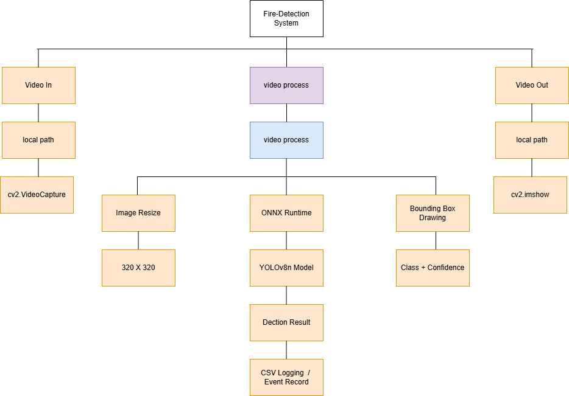
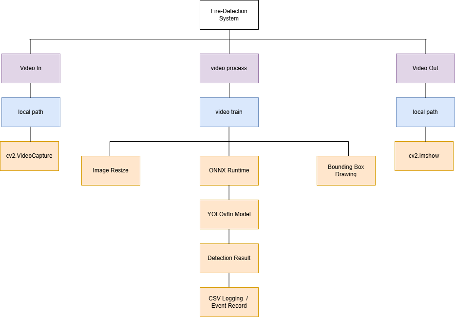

# YOLOv8 + Raspberry Pi 4 火災偵測系統完整開發

## 作業目標

本作業旨在建置一套基於 YOLOv8 與 Raspberry Pi 4 的即時火災偵測系統，利用 Edge AI 技術於本地端完成影像分析，降低雲端運算依賴，提高即時性與系統可靠度。

---

# 1. BreakDown & TREE




```text
yolov8-pi-project/
│
├── dataset/(以0.5秒猜切影片成圖片)
│   ├── images/
│   │   ├── all_png.....

│
├── output/
│   ├── burn0_fire_detected.mp4(輸出影片1)
│   ├── burn1_fire_detected.mp4(輸出影片2)
│   ├── burn2_fire_detected.mp4(輸出影片3)
│   ├── ......(圖片)
├── runs/(權重與訓練驗證集)
│   ├── detect
│   |  ├── train
│   |  |  ├── weights
│   |  |  ├──  best.pt
│   |  |  ├──  last.pt
│   |  |  ├──  BoxXX_curve.ong...
│   |  |  ├──  result.csv
│   |  |  ├──  result.png
│   |  |  ├──  train_batchxx.png...
│   |  |  ├──  val_batchxx.png...
│   |  |  ├──  args.yaml
│   |  |  ├──  ...
├── data.yaml
├── burn.mp4(測試影片檔案1)
├── burn1.mp4(測試影片檔案2)
├── burn2.mp4(測試影片檔案3)
├── detect.py
├── extract_frames.py
├── fire.yaml
├── yolo26n.pt
├── yolov8n.pt
└── README.md
└── ......
```

---

# 2. 架構圖




# 3. Dataset 準備

YOLO yaml格式：

**tain&val準備訓練驗證參數**

<details>
<summary><b>Train & Validation 訓練參數（點擊展開）</b></summary>

```yaml
task: detect
mode: train
model: yolov8n.pt
data: fire.yaml
epochs: 80
time: null
patience: 100
batch: 16
imgsz: 320
save: true
save_period: -1
cache: false
device: null
workers: 8
project: null
name: train
exist_ok: false
pretrained: true
optimizer: auto
verbose: true
seed: 0
deterministic: true
single_cls: false
rect: false
cos_lr: false
close_mosaic: 10
resume: false
amp: true
fraction: 1.0
profile: false
freeze: null
multi_scale: 0.0
compile: false
overlap_mask: true
mask_ratio: 4
dropout: 0.0
val: true
split: val
save_json: false
conf: null
iou: 0.7
max_det: 300
half: false
dnn: false
plots: true
end2end: null
source: null
vid_stride: 1
stream_buffer: false
visualize: false
augment: false
agnostic_nms: false
classes: null
retina_masks: false
embed: null
show: false
save_frames: false
save_txt: false
save_conf: false
save_crop: false
show_labels: true
show_conf: true
show_boxes: true
line_width: null
format: torchscript
keras: false
optimize: false
int8: false
dynamic: false
simplify: true
opset: null
workspace: null
nms: false
lr0: 0.01
lrf: 0.01
momentum: 0.937
weight_decay: 0.0005
warmup_epochs: 3.0
warmup_momentum: 0.8
warmup_bias_lr: 0.1
box: 7.5
cls: 0.5
cls_pw: 0.0
dfl: 1.5
pose: 12.0
kobj: 1.0
rle: 1.0
angle: 1.0
nbs: 64
hsv_h: 0.015
hsv_s: 0.7
hsv_v: 0.4
degrees: 0.0
translate: 0.1
scale: 0.5
shear: 0.0
perspective: 0.0
flipud: 0.0
fliplr: 0.5
bgr: 0.0
mosaic: 1.0
mixup: 0.0
cutmix: 0.0
copy_paste: 0.0
copy_paste_mode: flip
auto_augment: randaugment
erasing: 0.4
cfg: null
tracker: botsort.yaml
save_dir: your_path

```
</details>

---

# 4. 建立 fire.yaml

```yaml
path: dataset

train: images/train
val: images/val

nc: 2

names:
  0: fire
  1: smoke
```

---

# 5. 裁切測試檔案 YOLOv8

## extract_frames.py

```python
import cv2
import os

videos = ["burn.mp4", "burn1.mp4", "burn2.mp4"]

os.makedirs("dataset/images", exist_ok=True)

count = 0

for v in videos:
    cap = cv2.VideoCapture(v)

    while True:
        ret, frame = cap.read()
        if not ret:
            break

        # 每 5 frame 存一張（避免太多）
        if count % 5 == 0:
            cv2.imwrite(f"dataset/images/img_{count}.jpg", frame)

        count += 1

cap.release()

print("Done extracting frames")
)
```

## 執行訓練(產生權重檔案)

```bash
python detect_fire.py
```

---

# 6. 訓練結果分析

輸出目錄：

```text
runs/detect/train/
│
├── weights/
│   ├── best.pt
│   └── last.pt
│
├── confusion_matrix.png
├── results.png
├── PR_curve.png
└── F1_curve.png
```


---


# 7. Raspberry Pi 4 環境建置

## 更新系統

```bash
sudo apt update
sudo apt upgrade
```

## 安裝套件

```bash
sudo apt install python3-pip

pip3 install numpy
pip3 install pandas
pip3 install opencv-python
pip3 install onnxruntime
```

---

# 8. Raspberry Pi 即時推論

## detect.py(測試是否可以部屬Yolov8)

```python
from ultralytics import YOLO

model = YOLO("yolov8n.pt")

print("YOLO OK")
```

---

# 9. CSV紀錄系統

## 開始訓練

```python
yolo detect train model=yolov8n.pt data=fire.yaml epochs=80 imgsz=320) ##640 → 太慢  320 → 最佳 FPS 256 → 更快但稍降準確率
```

---

## 輸出模型

```python
runs/detect/train/weights/best.pt
```


# 10. 驗證與查看

**由於樹梅派是安裝純bash的版本這方面驗證我是利用SCP指令丟到PC端查看**
```python
scp -r ./yolov8_fire boting@192.168.1.168:/C:\Users\User\Desktop
```


# 11. 預期效能分析

## 降低解析度

```python
imgsz = 320
```

| 模型 | 解析度 | FPS | 說明 |
|--------|--------|--------|--------|
| YOLOv8n | 640 | 1~2 | rapberry pi 4 根本吃不消 |
| YOLOv8n | 320 | 3~6 | 此作業用法 |


# 12. 作業實際應用價值

## 智慧家庭

- 火災偵測
- 入侵偵測
- 老人跌倒偵測

---

## 智慧工廠

- 設備監控
- 安全警報
- 異常事件分析

---

## 智慧交通

- 車流分析
- 事故偵測
- 違規辨識

---

# 13. 為啥 Raspberry Pi 4 不適合大模型

## Raspberry Pi 4 硬體限制

| 項目 | 規格 |
|--------|--------|
| CPU | Cortex-A72 4 Core |
| GPU | VideoCore VI |
| RAM | 2GB / 4GB / 8GB |
| CUDA | 無 |
| Tensor Core | 無 |


**簡單來說pi 4 本身就有限制取決你想做到哪，如果用pi 5效果會大幅提升**
---

## 模型大小比較

| 模型 | 適用程度 |
|--------|--------|
| YOLOv8n | ✔ |
| YOLOv8s | ⚠ |
| YOLOv8m | ✘ |
| YOLOv8l | ✘ |
| YOLOv8x | ✘ |

---

## 原因1：計算量過大

CNN每層都需要大量卷積運算。

模型越大：

```text
運算量暴增
↓
FPS下降
↓
延遲增加
```

---

## 原因2：RAM不足

Feature Map過大：

```text
RAM耗盡
↓
Swap
↓
SD Card存取
↓
速度暴跌
```

---

## 原因3：缺乏GPU

Pi只能依靠CPU運算。

相較桌機：

```text
效能差距可達10~50倍
```

---

# 14. 未來展望

## Tiny AI

未來模型將持續縮小：

- YOLOv10 Nano
- MobileNet Detector
- Tiny Detector

---

## AI加速器

未來可結合：

- Coral TPU
- Hailo-8
- Jetson系列

---

## 模型壓縮

技術包含：

### Quantization

```text
FP32
↓
INT8
```

---

### Pruning

```text
移除無效權重
```

---

### Knowledge Distillation

```text
大模型教小模型
```

---

## IoT整合

**可以加入即時影像去辨識**

```text
Camera
  ↓
Edge AI
  ↓
MQTT
  ↓
Cloud
  ↓
Dashboard
```

---

# 15. 結論

本系統利用 YOLOv8n 與 Raspberry Pi 4 建立低成本 Edge AI 火災偵測平台。

透過：

- YOLOv8n
- Raspberry Pi 4
- CSV Logging

可實現即時火災監測與事件紀錄。

由於 Raspberry Pi 4 的 CPU、記憶體及 AI 加速能力有限，因此必須在模型準確率與推論速度之間取得平衡。

YOLOv8n 搭配 ONNX Runtime 與 320×320 解析度，是目前在 Raspberry Pi 4 上最具實務價值且穩定的部署方案。

未來可透過：

- Coral TPU
- Jetson Orin
- Quantization
- Pruning
- MQTT Cloud Integration

進一步提升系統效能與工業應用價值。
